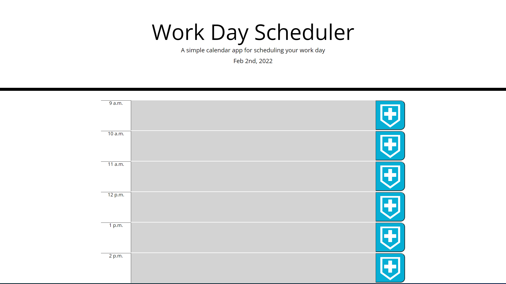

# workdayscheduler

Herein lies a workday scheduler, on the timeblocks you can write whatever todos you have for that particular day and the timeblocks will changes color comparatively to the current hour of the day to help keep you organized. All entries are saved with local storage and will be rendered where you wrote them when exiting the broswer and reentering. 

Deployed site here:
https://marlowemich.github.io/workdayscheduler/